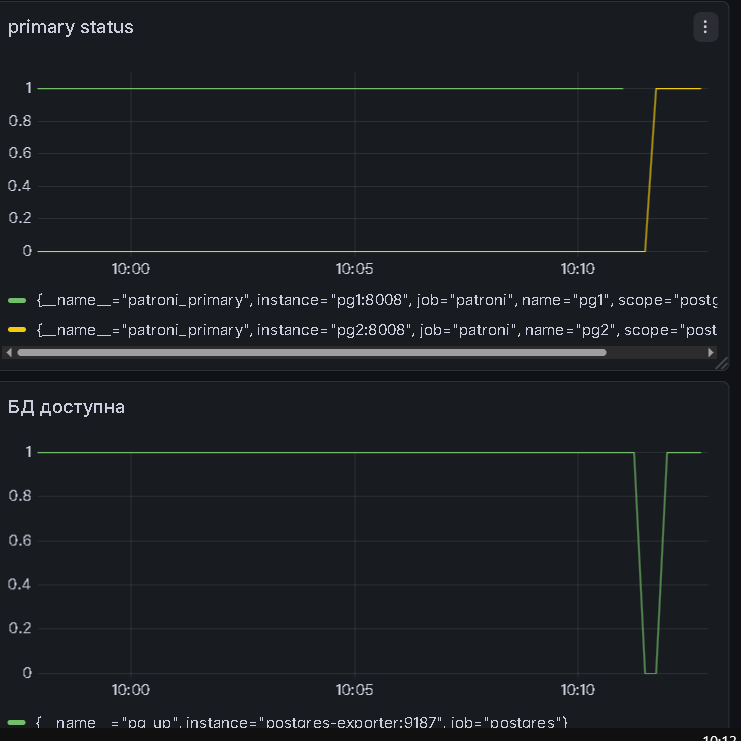
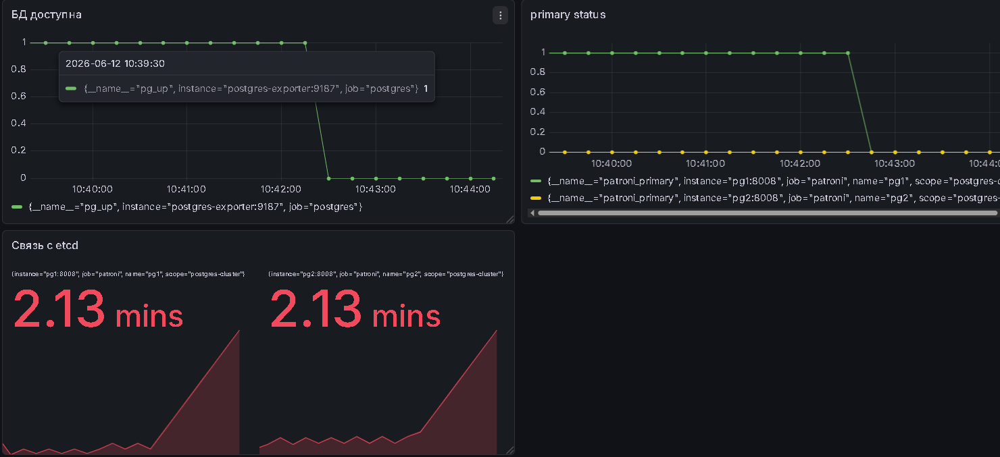

# Сценарий 1: Отказ основного узла СУБД

### 1. Исходное состояние кластера

Перед началом эксперимента кластер Patroni находится в стабильном состоянии. Узел `pg1` является лидером, узел `pg2` —
репликой.

```text
+ Cluster: postgres-cluster (7650397028789198888) -------+-----+------------+-----+
| Member | Host | Role    | State     | TL | Receive LSN | Lag | Replay LSN | Lag |
+--------+------+---------+-----------+----+-------------+-----+------------+-----+
| pg1    | pg1  | Leader  | running   |  1 |             |     |            |     |
| pg2    | pg2  | Replica | streaming |  1 |   0/39E3BD8 |   0 |  0/39E3BD8 |   0 |
+--------+------+---------+-----------+----+-------------+-----+------------+-----+
```

Параллельно запущен тестовый скрипт, имитирующий непрерывные запросы клиентов к БД через HAProxy:

```text
 now              ------------------  2026-06-12 07:08:02.760386+00 | 172.23.0.7 (1 row) 
 now              ------------------  2026-06-12 07:08:04.21653+00 | 172.23.0.7 (1 row) 
 now              ------------------  2026-06-12 07:08:05.546219+00 | 172.23.0.7 (1 row) 
 now              ------------------  2026-06-12 07:08:06.815254+00 | 172.23.0.7 (1 row)
```

### 2. Имитация сбоя и процесс failover

Убиваем лидера (`docker run --rm -v //var/run/docker.sock:/var/run/docker.sock ghcr.io/alexei-led/pumba kill pg1`)
Лог работы клиента фиксирует кратковременную потерю связи, после чего запросы автоматически перенаправляются на новый
поднявшийся узел pg2:

```text
now              ------------------  2026-06-12 07:11:06.003486+00 | 172.23.0.7 (1 row) 
now              ------------------  2026-06-12 07:11:07.439177+00 | 172.23.0.7 (1 row) 
Connection error!
Connection error!
Connection error!
Connection error!
Connection error!
Connection error!
Connection error!
Connection error!
Connection error!
Connection error!
now              ------------------  2026-06-12 07:11:36.945704+00 | 172.23.0.6 (1 row) 
now              ------------------  2026-06-12 07:11:38.213057+00 | 172.23.0.6 (1 row)
```

### 3. Состояние кластера после переключения

После завершения процесса Failover узел pg2 успешно перешел в роль нового лидера кластера:

```text
+ Cluster: postgres-cluster (7650397028789198888) ----+-----+------------+-----+
| Member | Host | Role   | State   | TL | Receive LSN | Lag | Replay LSN | Lag |
+--------+------+--------+---------+----+-------------+-----+------------+-----+
| pg2    | pg2  | Leader | running |  2 |             |     |            |     |
+--------+------+--------+---------+----+-------------+-----+------------+-----+
```



# Сценарий 2: Потеря связи с etcd

### 1. Подготовка

Запускаем скрипт, который создает тестовою таблицу и добавляет туда строки:

```text
Successful write. Rows in table: CREATE TABLE INSERT 0 1  count  -------      1 (1 row) 
Successful write. Rows in table: CREATE TABLE INSERT 0 1  count  -------      2 (1 row) 
Successful write. Rows in table: CREATE TABLE INSERT 0 1  count  -------      3 (1 row) 
```

Кластер полностью запущен:

```text
+ Cluster: postgres-cluster (7650397028789198888) -------+-----+------------+-----+
| Member | Host | Role    | State     | TL | Receive LSN | Lag | Replay LSN | Lag |
+--------+------+---------+-----------+----+-------------+-----+------------+-----+
| pg1    | pg1  | Leader  | running   |  3 |             |     |            |     |
| pg2    | pg2  | Replica | streaming |  3 |   0/3AEDD88 |   0 |  0/3AEDD88 |   0 |
+--------+------+---------+-----------+----+-------------+-----+------------+-----+
```

### Имитация отказа

Останавливаем etcd и видим, что скрипт не может писать в бд:

```text
Successful write. Rows in table: CREATE TABLE INSERT 0 1  count  -------    109 (1 row) 
Successful write. Rows in table: CREATE TABLE INSERT 0 1  count  -------    110 (1 row) 
CONNECT OR WRITE ERROR!
CONNECT OR WRITE ERROR!
CONNECT OR WRITE ERROR!
```



### Поведение patroni при отказе

#### Потеря связи с DCS

Patroni пытается связаться с узлами etcd:

```text
2026-06-12 07:42:16,026 ERROR: Request to server http://etcd2:2379 failed... Connection refused
2026-06-12 07:42:17,695 ERROR: Request to server http://etcd3:2379 failed... Connection to etcd3 timed out
2026-06-12 07:42:27,674 ERROR: Error communicating with DCS
```

#### Принятие решения о саморазжаловании

Поскольку DCS недоступен, текущий лидер pg1 больше не может гарантировать, что он является единственным мастером в сети.
Во избежание несогласованности данных Patroni принимает решение безопасно снять с себя роль лидера:

```text
2026-06-12 07:42:27,675 INFO: demoting self because DCS is not accessible and I was a leader
2026-06-12 07:42:27,675 INFO: Demoting self (offline)
```

#### Реакция клиента на запись

Наш пишущий скрипт продолжает слать запросы на запись (пытается выполнить CREATE TABLE и INSERT) через HAProxy.
Но бд отказывает:

```text
2026-06-12 07:42:30.063 UTC [1272] ERROR:  cannot execute CREATE TABLE in a read-only transaction
2026-06-12 07:42:30.063 UTC [1272] STATEMENT:  
CREATE TABLE IF NOT EXISTS test_etcd_outage (val text);
INSERT INTO test_etcd_outage VALUES ('test');
```

### Восстановление etcd

Восстанавливаем etcd:

```text
CONNECT OR WRITE ERROR!
CONNECT OR WRITE ERROR!
CONNECT OR WRITE ERROR!
Successful write. Rows in table: CREATE TABLE INSERT 0 1  count  -------    137 (1 row) 
Successful write. Rows in table: CREATE TABLE INSERT 0 1  count  -------    138 (1 row) 
Successful write. Rows in table: CREATE TABLE INSERT 0 1  count  -------    139 (1 row) 
```

```text
+ Cluster: postgres-cluster (7650397028789198888) -------+-----+------------+-----+
| Member | Host | Role    | State     | TL | Receive LSN | Lag | Replay LSN | Lag |
+--------+------+---------+-----------+----+-------------+-----+------------+-----+
| pg1    | pg1  | Leader  | running   |  5 |             |     |            |     |
| pg2    | pg2  | Replica | streaming |  5 |   0/3AF9350 |   0 |  0/3AF9350 |   0 |
+--------+------+---------+-----------+----+-------------+-----+------------+-----+
```

### Поведение patroni при восстановлении

#### Обнаружение восстановленного etcd и захват блокировки

Как только etcd поднялся, Patroni на pg1 мгновенно подключился к нему и инициировал процесс возвращения роли лидера:

```text
   2026-06-12 07:52:59,188 INFO: Lock owner: pg1; I am pg1
   2026-06-12 07:52:59,348 INFO: promoted self to leader because I had the session lock
  ```

#### Переход в штатный режим работы

Patroni переходит в стандартный цикл мониторинга:

```text
   2026-06-12 07:53:00,603 INFO: no action. I am (pg1), the leader with the lock
   2026-06-12 07:53:09,744 INFO: no action. I am (pg1), the leader with the lock
```
