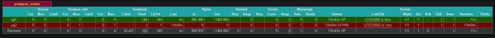
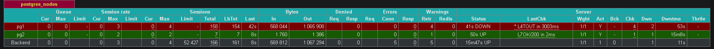

Было:
```
+ Cluster: postgres-cluster (7635984966682292265) -------+-----+------------+-----+
| Member | Host | Role    | State     | TL | Receive LSN | Lag | Replay LSN | Lag |
+--------+------+---------+-----------+----+-------------+-----+------------+-----+
| pg1    | pg1  | Leader  | running   |  1 |             |     |            |     |
| pg2    | pg2  | Replica | streaming |  1 |   0/38B9598 |   0 |  0/38B9598 |   0 |
+--------+------+---------+-----------+----+-------------+-----+------------+-----+
```



Далее отключаем pg1 - leader, и pg2 должен его заменить.
```
+ Cluster: postgres-cluster (7635984966682292265) ----+-----+------------+-----+
| Member | Host | Role   | State   | TL | Receive LSN | Lag | Replay LSN | Lag |
+--------+------+--------+---------+----+-------------+-----+------------+-----+
| pg2    | pg2  | Leader | running |  2 |             |     |            |     |
+--------+------+--------+---------+----+-------------+-----+------------+-----+
```
